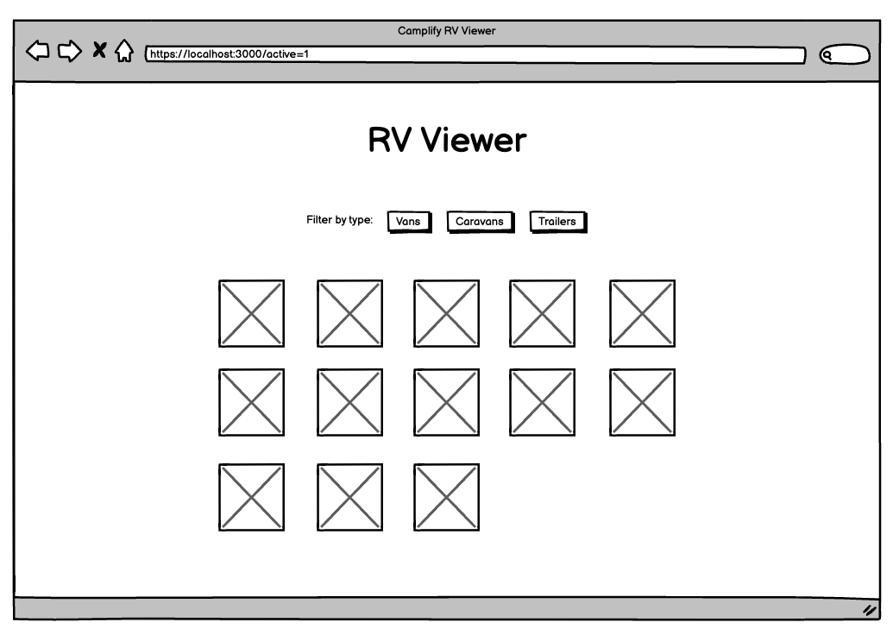

# Camplify Frontend Challenge 🚐

This is a [Next.js](https://nextjs.org/) project bootstrapped with [`create-next-app`](https://github.com/vercel/next.js/tree/canary/packages/create-next-app).

## Getting Started

**Run the development server:**

```bash
npm run dev
# or
yarn dev
```

**Initialise git for this codebase:**

```bash
git init
```

## The Challenge

Your task is to finish a fictional "RV Viewer" page and pass the following requirements. You have a low-level UX sketch to use as a solution reference.

**Mock**



**Fetch Requirements**

- Fetch the data from the provided dummy API endpoint: `localhost:3000/api/rvs`
- A loading state should display the `<Spinner>` component when fetching
- When there is no data, the UI should display "Sorry, no results found"
- When there is an error, the UI should display "Sorry, something went wrong"

**UI Requirements**

- Display the rv results on the page in a grid format (max 5 columns)
- Each RV card should contain the following data in the UI [name, location, coverImage, vanType]
- There should be 3 buttons that when clicked, filter the results by rv type [van, caravan, trailer]
- Only show _active_ vans in the results if a URL param `active=1` is true
- Only show _inactive_ vans in the results if a URL param `inactive=1` is true

**Technical Requirements**

- You can write the solution using JavaScript or TypeScript
- Maintain the brand by using our "theme tokens" values in CSS
- You should use commits along the way
- Bonus points for documentation explaining your choices

## Submission

Please zip your solution and attach to the initial coding challenge email.
